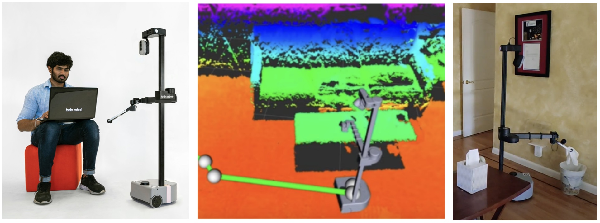

# 16-762: Mobile Manipulation (Spring 2024)

## Course Info

#### [Syllabus](https://docs.google.com/document/d/1kWtvakADIGxY1ZWRYh876Qx_CZqxNd2QK4lL86yxwtc/edit?usp=sharing)  

#### [Course Project Statement](https://docs.google.com/document/d/1-YopWf3rgZIXj8K8etmIaN4xQxTrqCX0CE65OgAPw54/edit?usp=sharing)  

#### [Midterm Presentation Grading Rubric](https://docs.google.com/document/d/1Fcd_MO8JpOwfO06iXpZKfY0ATKlladNyrJNt1d8xx5M/edit?usp=sharing)  

#### [Final Presentation Grading Rubric](https://docs.google.com/document/d/1si1jkm06OM3fBmYhkAvitWLPYM2dsrDyS1M7KM-YloY/edit?usp=sharing)  

#### [Final Report Grading Rubric](https://docs.google.com/document/d/1sPBoVYKR543XYfci39k4LwDjfXUWVVxVyaOIcgP0gNs/edit?usp=sharing)  

**Time**: Monday & Wednesday 3:30 - 4:50 PM  
**Location**: NSH 3002  
**Instructor**: [Zackory Erickson](https://zackory.com)  
**Office Hours**: Upon request  
**Course Questions and Discussion**: Slack -- Registered students will be added

---

## Course Description

In this project-based course, you'll learn about mobile manipulation through hands-on experience working with real mobile manipulators. You'll gain experience with teleoperation, autonomy, perception, navigation, manipulation, and human-robot interaction, all within the context of mobile manipulators. You'll also learn about robot design, collaborative research, and applications for mobile manipulators.

This is a graduate-level project-based course for students interested in mobile manipulation. There are no exams nor textbook assignments. You will be working with a group of your peers to develop solutions to real-world problems through the control of a mobile manipulator. There are two projects where you will work with **_real mobile manipulators_** and build on state-of-the-art methods from scientific literature, all leading to a video recording, live robot demonstration, presentation, and short paper to disseminate your results.

### Pre-Requisites
Prior experience with the Python programming language is encouraged and extremely beneficial. 

---

## History and Example Projects

This course has been developed and inspired based on a prior project-based course on mobile manipulation for robotic caregiving, taught at CMU and Georgia Tech.

Examples of past mobile manipulation projects can be found on the following course webpage: [16-887: Robotic Caregivers and Intelligent Physical Collaboration (2023)](https://zackory.com/rc2023/)

## Credit

Earlier versions of this course were co-developed and co-instructed with [Prof. Charlie Kemp](https://charliekemp.com) at Georgia Tech. Early versions at Georgia Tech emphasized robotic caregiving through mobile manipulation: [Robotic Caregivers](https://sites.gatech.edu/robotic-caregivers/).

